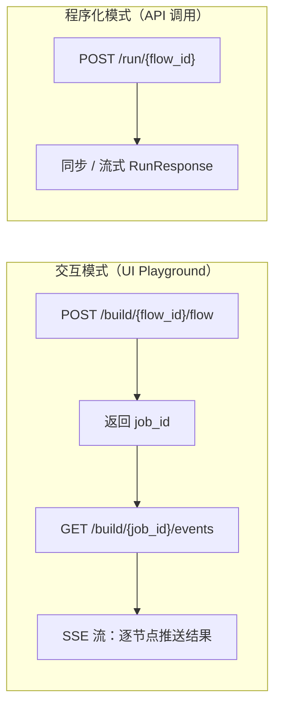
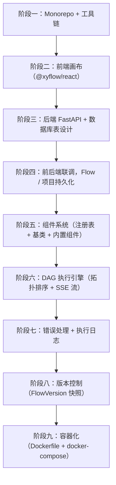

# 基于 Langflow 的可视化 AI 工作流平台任务拆解

本文基于 Langflow 的实际实现方式，整理一份可落地的开发拆解方案。范围控制在首版闭环，不追求一次覆盖全部能力，优先搭出具备画布编排、组件注册、工作流执行、版本管理和部署能力的基础系统。整体设计沿前端画布、后端服务、组件系统、执行引擎四条主线展开，确保每个阶段都能交付可运行产物。

---

## 阶段一：Monorepo 基础架构搭建

**目标**：建立项目骨架，统一工具链。

参考 Langflow 的 `src/` 目录结构：

```text
src/
  backend/   # Python FastAPI 服务
  frontend/  # React TypeScript 应用
  lfx/       # 轻量执行器（可选，初期可合并到 backend）
  sdk/       # Python 客户端（可选，后期再做）
```

**具体任务**：

* 初始化 `uv` 工作空间（`pyproject.toml` + `uv.lock`），管理多个 Python 包
* 初始化前端根 `package.json`，配置 Vite + TypeScript
* 编写 `Makefile`，提供 `make dev`、`make build`、`make test` 等快捷命令
* 配置 `.env.example`、`.gitignore`、`pre-commit`（ruff + eslint）
* 配置 `docker-compose.yml`（开发环境，包含 PostgreSQL）

---

## 阶段二：前端——可视化画布核心

**目标**：先跑通一个能拖拽、连线的画布，不依赖后端。

Langflow 前端核心依赖为 `@xyflow/react`（画布）、Zustand（本地状态）、React Query（服务端状态）。

### 2.1 项目初始化

* Vite + React 19 + TypeScript
* 安装 `@xyflow/react`、`zustand`、`@tanstack/react-query`、`tailwindcss`

### 2.2 画布基础（最小可用版本）

* 实现 `FlowPage`，包裹 `<ReactFlow>` 组件
* 注册两种节点类型：`genericNode`（组件节点）、`noteNode`（便签）
* 实现 `onDrop`：从侧边栏拖拽组件到画布，生成新节点
* 实现 `onConnect`：连线时做类型兼容性校验，要求 source output type 匹配 target input type
* 实现对齐辅助线（`getHelperLines`）

### 2.3 节点渲染（GenericNode）

* `GenericNode`：根据组件元数据动态渲染输入 / 输出 handle、参数配置面板
* 输入类型映射不同 UI 控件：

  * `StrInput`：文本框
  * `BoolInput`：开关
  * `IntInput`：数字框
  * `HandleInput`：连接点
* 节点工具栏（右键菜单）：复制、删除、冻结、查看代码

### 2.4 状态管理

* `useFlowStore`（Zustand）：管理 `nodes`、`edges`、`reactFlowInstance`、`flowPool`（执行结果缓存）
* `useFlowsManagerStore`：管理多个 flow 列表、undo / redo 历史（`takeSnapshot` + `past[]` 数组）

### 2.5 快捷键

* `Ctrl+Z / Ctrl+Y`：undo / redo
* `Ctrl+C / Ctrl+V / Ctrl+D`：复制 / 粘贴 / 复制节点
* `Delete`：删除选中
* `Ctrl+G`：将选中节点打组

### 2.6 侧边栏组件列表 + 项目管理侧边栏

* 左侧组件分类列表：从后端 `GET /api/v1/all` 获取，初期可用 mock 数据
* 左侧项目（Folder）列表：支持新建、重命名、删除

---

## 阶段三：后端——FastAPI 基础 + 数据库

**目标**：搭建后端服务，设计表结构，实现基础 CRUD。

### 3.1 FastAPI 应用初始化

* 使用工厂模式创建 app（`create_app()`），配置 middleware、CORS、异常处理
* 使用 `lifespan` 上下文管理器，在启动时初始化数据库、加载组件注册表
* 引入服务层（`ServiceManager`），统一管理 `DatabaseService`、`SettingsService`、`AuthService` 等，通过依赖注入提供给路由

### 3.2 数据库设计（SQLModel + Alembic）

核心表结构：

| 表名             | 关键字段                                                     | 说明                    |
| -------------- | -------------------------------------------------------- | --------------------- |
| `user`         | `id`, `username`, `password_hash`, `is_superuser`        | 用户                    |
| `folder`       | `id`, `name`, `user_id`                                  | 项目（文件夹）               |
| `flow`         | `id`, `name`, `data(JSON)`, `folder_id`, `endpoint_name` | 工作流，`data` 存整个画布 JSON |
| `flow_version` | `id`, `flow_id`, `data(JSON)`, `version_number`, `name`  | 版本快照                  |
| `message`      | `id`, `flow_id`, `session_id`, `text`, `sender`          | 聊天记录                  |
| `transaction`  | `id`, `flow_id`, `status`, `error`                       | 执行日志                  |
| `vertex_build` | `id`, `flow_id`, `vertex_id`, `data(JSON)`               | 节点执行结果缓存              |
| `api_key`      | `id`, `user_id`, `key_hash`                              | API 密钥                |
| `variable`     | `id`, `user_id`, `name`, `value(encrypted)`              | 全局变量 / 密钥             |

补充任务：

* 配置 Alembic 做 schema 迁移，每次改表结构生成 migration 文件
* 数据库驱动：

  * 开发环境：SQLite + `aiosqlite`
  * 生产环境：PostgreSQL + `psycopg`

### 3.3 基础 API 端点

* `GET /api/v1/all`：返回所有组件的模板定义（组件注册表）
* `CRUD /api/v1/folders/`：项目管理
* `CRUD /api/v1/flows/`：flow 管理，包含导入 / 导出 JSON
* `POST /api/v1/login`
* `GET /api/v1/auto_login`

---

## 阶段四：前后端联调——项目与 Flow 管理

**目标**：画布数据持久化到数据库，实现完整的项目 / Flow 管理闭环。

**具体任务**：

* 前端用 React Query 封装所有 API 调用，如 `useGetFolders`、`useGetFlows`、`usePostFlow`
* 实现画布自动保存：节点 / 连线变化时 debounce 触发 `PATCH /api/v1/flows/{id}`
* 支持 Flow 导入 / 导出：拖拽 JSON 文件到画布导入，导出为 JSON
* 支持项目间移动 Flow：通过 `PATCH /api/v1/flows/{id}` 更新 `folder_id`
* 支持项目导出为 ZIP（包含所有 flows）与 ZIP 导入

---

## 阶段五：组件系统

**目标**：实现可扩展的组件注册与加载机制。

### 5.1 组件注册表（`component_index.json`）

* 定义 JSON 格式：每个组件包含：

  * `display_name`
  * `description`
  * `template`（输入字段定义）
  * `outputs`（输出端口定义）
  * `metadata`（Python 模块路径、`code_hash`）
* 编写脚本 `build_component_index.py`：扫描所有组件 Python 文件，自动生成 `component_index.json`

### 5.2 组件基类（Python）

```python
class Component:
    display_name: str
    description: str
    inputs: list[InputField]
    outputs: list[OutputField]

    async def build_results(self) -> dict: ...
```

### 5.3 内置组件（按优先级）

1. **输入 / 输出**：`ChatInput`、`ChatOutput`、`TextInput`
2. **LLM**：OpenAI、Anthropic（通过 LangChain 集成）
3. **Prompt**：`PromptTemplate`
4. **工具**：`PythonCode`（执行自定义 Python 代码）
5. **数据处理**：`ParseData`、`SplitText`

### 5.4 自定义组件支持

* 用户可在 UI 中编辑组件 Python 代码（代码编辑器）
* 后端通过 `eval_custom_component_code(code)` 动态加载用户代码

---

## 阶段六：工作流执行引擎（DAG）

**目标**：实现核心的图执行逻辑。

### 6.1 Graph 构建

* `Graph.from_payload(json_data)`：将画布 JSON（`nodes + edges`）反序列化为 `Graph` 对象
* `graph.prepare()`：完成拓扑排序，计算 `first_layer`（无前驱节点）和 `vertices_to_run`

### 6.2 两种执行模式



### 6.3 节点执行

* `instantiate_class(vertex)`：`eval` 组件代码，实例化 Python 对象
* `build_component()`：调用 `component.build_results()` 获取输出
* 全局变量解析：`update_params_with_load_from_db_fields()`，从数据库读取加密的 API Key 等

### 6.4 Tweaks 机制

* `process_tweaks(graph_data, tweaks)`：API 调用时允许覆盖节点参数，但禁止覆盖 `code` 字段

### 6.5 前端执行流程

* 前端 `buildUtils.ts` 发起 build 请求
* 订阅 SSE 事件流
* 将每个节点的执行结果写入 `flowPool`（Zustand store）
* 节点 UI 实时更新状态：运行中、成功、失败

---

## 阶段七：错误处理与日志

**目标**：建立系统化的错误捕获、用户友好的错误展示和可查询的执行日志。

### 7.1 后端错误分层

* **代码校验**：`POST /api/v1/validate/code`，提交前检查语法和 import 错误
* **构建错误**：`ComponentBuildError`，节点执行失败时抛出，并写入 `transaction` 表
* **校验错误**：`CustomComponentValidationError`，输入不满足模板要求
* **全局异常处理器**：通过 FastAPI middleware 捕获未处理异常，返回统一格式

### 7.2 执行日志存储

* 每次执行写入 `transaction` 表：`flow_id`、`status`、`error`、`timestamp`
* 每个节点执行结果写入 `vertex_build` 表，用于缓存，避免重复执行
* 定期清理旧记录：`max_transactions_to_keep`、`max_vertex_builds_to_keep`

### 7.3 前端错误展示

* 节点边框变红，显示错误信息 tooltip
* 画布加载时执行 `cleanEdges()`，自动移除指向不存在 handle 的连线

---

## 阶段八：版本控制

**目标**：实现 Flow 快照保存与恢复。

基于 `FlowVersion` 模型，对应端点如下：

| 端点                                                | 功能                      |
| ------------------------------------------------- | ----------------------- |
| `POST /api/v1/flow_versions/`                     | 保存当前 flow 为快照（含可选 name） |
| `GET /api/v1/flow_versions/{flow_id}`             | 列出所有历史版本                |
| `POST /api/v1/flow_versions/{version_id}/restore` | 将 flow 数据回滚到该版本         |
| `DELETE /api/v1/flow_versions/{version_id}`       | 删除某个版本                  |

需要明确区分两种“历史”：

* **本地 undo / redo**：前端 `useFlowsManagerStore` 的 `past[]` 数组，仅在当前会话有效
* **持久化版本**：`FlowVersion` 数据库记录，跨会话保留

---

## 阶段九：容器化与部署

**目标**：形成生产可用的容器化方案。

### 9.1 Dockerfile（多阶段构建）

```text
Stage 1: node builder   -> 构建前端静态文件
Stage 2: python runtime -> 安装后端依赖，复制前端 build 产物
```

后端在生产模式下直接服务前端静态文件，单端口为 `7860`。

### 9.2 两种镜像

* **IDE 镜像**：包含前端，用于开发 / 测试环境，提供完整 UI
* **Runtime 镜像**：仅包含后端，用于生产环境，运行 `--backend-only` 模式，提供 headless API 服务

### 9.3 `docker-compose`（生产）

```yaml
services:
  app:      # 应用容器
  postgres: # 数据库（生产必须使用 PostgreSQL，不使用 SQLite）
```

### 9.4 Kubernetes（可选，规模化）

* Helm Chart：IDE deployment 与 Runtime deployment 分开
* Runtime 支持水平扩展（多副本），最低配置为 `2Gi RAM + 1 CPU × 3` 副本

---

## 整体顺序



---

## 关键决策点

* 阶段二前端可直接使用 mock 数据，硬编码少量组件定义，不依赖后端先跑通画布
* 阶段五的组件系统是整个项目的核心难点，`component_index.json` 的 schema 需要尽早定稿，因为前后端都会依赖它
* 阶段六的执行引擎建议单独拆成一个包，类似 Langflow 的 `lfx`，方便后期做轻量化部署、独立扩展和执行层解耦

---

## 结语

这个拆解顺序的重点不在于一次性把所有能力做完，而在于每个阶段都产出一个可运行、可验证、可继续叠加的系统部件。前端先把画布和交互做起来，后端再补持久化和组件注册，执行引擎最后补齐运行能力。这样推进，工程风险更低，演示闭环也更早形成。